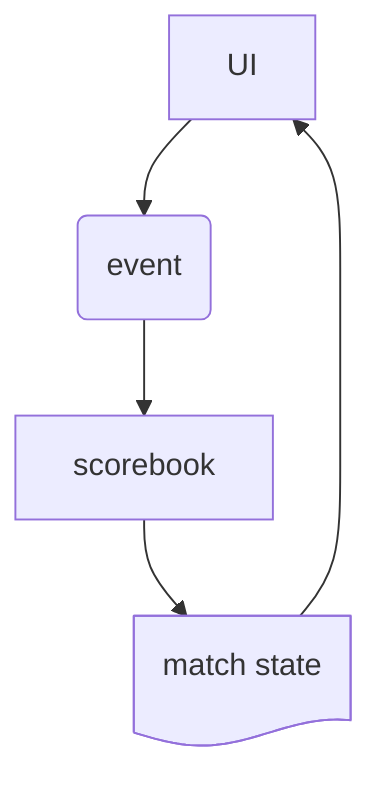

# ec2

## Purpose

To become a standalone cricket scoring package that has value in its own right as well as being able to support my `extracover` project.

## Proposed Approach

All Python, front- (using [NiceGUI](https://nicegui.io/)) and back-ends.
Another front-end option, which might offer more multi-platform capabilities (phones, for example) is [Flet](https://flet.dev/), which makes use of Flutter under the hood. That's a long-range consideration at best, for now.

## Architecture (???)

## Tech Notes

### Creating the project with [uv](https://docs.astral.sh/uv/)

That's `uv`, see https://docs.astral.sh/uv/

Had some initial trouble with this, possibly because the docs [here](https://docs.astral.sh/uv/concepts/projects/init/#packaged-applications) may have assumed that I knew that something needed to happen in between the `init` and `run` parts, or maybe the example in that doc needed `--app`, which wasn't in the code shown. Documentation is hard.

    uv init --app --package ec2 --python 3.13
    cd ec2
    uv build
    uv run ec2 # Hello from ec2!

